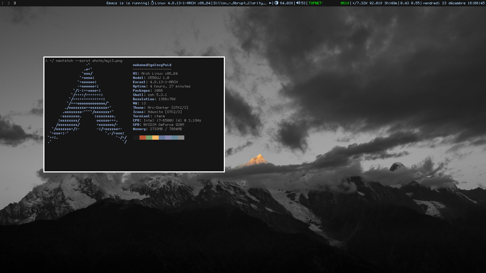

## I3pystatus

This is the code I use to configure my status.

This code will work on a virtual environment but make sure you edit the VENV_PATH in the code.

This is a scrot of my bar. (I will link to my i3config)

Oh and excuse the floating I just wanted to show my background.

### Installing

1) Clone the repo:

	$ git clone https://github.com/mohamed-aziz/i3pystatus-config.git

2) I suggest making a virtualenv:

	$ virtualenv i3PystatusHacking

3) Install the requirements:

	$ source i3PystatusHacking/bin/activate
	$ cd i3pystatus-config
	(i3PystatusHacking) $ pip install -r requirements.txt

**I use [my own fork of i3pystatus](https://github.com/mohamed-aziz/i3pystatus) please don't report bugs (unless it's related to the modules I wrote)**

4) Change the VENV_PATH variable in your statusconfig.py with your virtualenv activation file.

5) And don't forget to call the program in your bar section in your i3 config, I have this:

	bar {
		some stuff
		status_command python ~/i3pyconfig/statusconfig.py
	}

Now restart your i3 and the changes should take effect.
